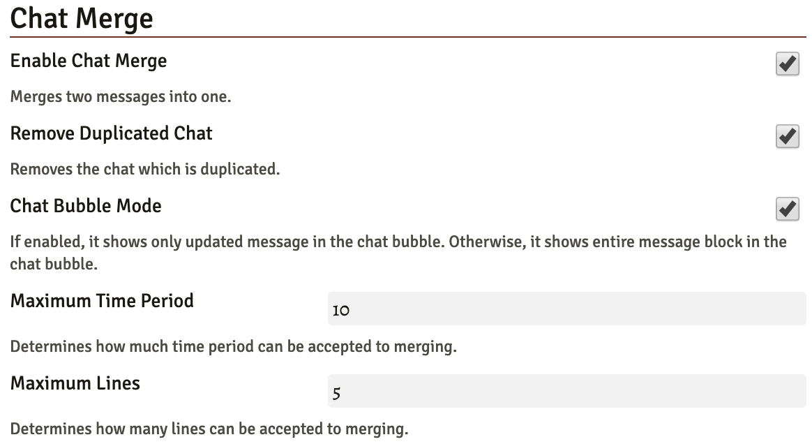

# Chat Merge

This module merges chat messages from the same speaker. You can configure time and line for splitting the message box.

There is two optional features, removing duplicated chat and chat bubble mode.

You can toggle how to show token chat bubble. When two messages are merged, you can choose whether it shows only last one or entire one.

### Options

Manifest : https://raw.githubusercontent.com/FoundryModule/Modules/master/ChatMerge/module.json
